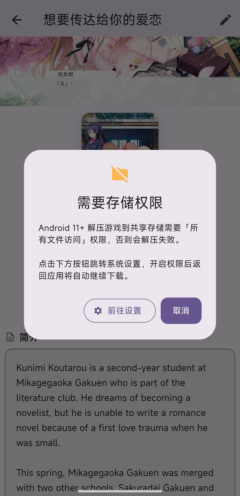

# Sena-Repo 部署说明书

## 目录

- [概述](#概述)
- [服务端部署](#服务端部署)
- [客户端安装](#客户端安装)
- [首次设置](#首次设置)
- [游戏库](#游戏库)
- [游戏详情与元数据编辑](#游戏详情与元数据编辑)
- [游戏下载](#游戏下载)
- [Steam 补丁注入](#steam-补丁注入)
- [用户管理](#用户管理)
- [设置与个性化](#设置与个性化)
- [回收站](#回收站)
- [导入及清洗逻辑](#导入及清洗逻辑)
- [附录](#附录)

---

## 概述

Sena Repo 是 C/S 架构的 Galgame 私有库管理器。服务端部署在 NAS 或服务器上，负责扫描游戏文件、刮削元数据、提供下载；客户端安装在 Windows / Android / Linux 上，通过 HTTP/HTTPS 连接服务端，提供浏览、搜索、下载、编辑等完整功能。

**典型使用场景：** 将游戏压缩包按规范目录结构放在 NAS 上 → 服务端自动扫描导入 → 手机/电脑上的客户端连接服务端 → 浏览游戏库 → 下载想玩的游戏 → 客户端自动解压安装。

---

## 服务端部署

### 方式一：GHCR 拉取（推荐）

每次 Release 发布时，Docker 镜像会自动推送到 GitHub Container Registry。本仓库公开，镜像可直接拉取，无需登录。

```bash
# 拉取最新版本
docker pull ghcr.io/404-gcross/sena-repo:latest

# 或拉取指定版本
docker pull ghcr.io/404-gcross/sena-repo:v0.1.0
```

**启动容器：**

```bash
# 基础启动
docker run -d \
  --name sena-repo \
  -p 11451:11451 \
  -v /path/to/games:/games \
  -v /path/to/data:/data \
  -v /path/to/steam_patches:/steam_patch \
  ghcr.io/404-gcross/sena-repo:latest

# 完整启动（含刮削 API Key）
docker run -d \
  --name sena-repo \
  -p 11451:11451 \
  -v /path/to/games:/games \
  -v /path/to/data:/data \
  -v /path/to/steam_patches:/steam_patch \
  -e SENA_BANGUMI_TOKEN="your_token" \
  -e SENA_VNDB_TOKEN="your_token" \
  -e SENA_IGDB_CLIENT_ID="your_id" \
  -e SENA_IGDB_CLIENT_SECRET="your_secret" \
  -e SENA_PROXY="http://127.0.0.1:7890" \
  ghcr.io/404-gcross/sena-repo:latest
```

**Docker Compose：**

```yaml
services:
  sena-repo:
    image: ghcr.io/404-gcross/sena-repo:latest
    container_name: sena-repo
    ports:
      - "11451:11451"
    volumes:
      - /path/to/games:/games
      - /path/to/data:/data
      - /path/to/steam_patches:/steam_patch
    environment:
      - SENA_BANGUMI_TOKEN=your_token      # 可选
      - SENA_VNDB_TOKEN=your_token         # 可选
      - SENA_IGDB_CLIENT_ID=your_id        # 可选
      - SENA_IGDB_CLIENT_SECRET=your_secret # 可选
      - SENA_PROXY=http://127.0.0.1:7890   # 可选，刮削代理
    restart: unless-stopped
```

### 方式二：Tarball 加载

从 [Releases](https://github.com/404-GCross/Sena-Repo/releases) 下载 `Sena-Repo_Server_v*.tar.gz` 后手动加载。

```bash
docker load < Sena-Repo_Server_v0.1.0.tar.gz

# 基础启动
docker run -d \
  --name sena-repo \
  -p 11451:11451 \
  -v /path/to/games:/games \
  -v /path/to/data:/data \
  -v /path/to/steam_patches:/steam_patch \
  sena-repo:latest

# 完整启动（含刮削 API Key）
docker run -d \
  --name sena-repo \
  -p 11451:11451 \
  -v /path/to/games:/games \
  -v /path/to/data:/data \
  -v /path/to/steam_patches:/steam_patch \
  -e SENA_BANGUMI_TOKEN="your_token" \
  -e SENA_VNDB_TOKEN="your_token" \
  -e SENA_IGDB_CLIENT_ID="your_id" \
  -e SENA_IGDB_CLIENT_SECRET="your_secret" \
  -e SENA_PROXY="http://127.0.0.1:7890" \
  sena-repo:latest
```

### 挂载说明

| 目录 | 作用 | 是否必须 |
|------|------|---------|
| `/games` | 游戏文件存放目录 | 是 |
| `/data` | 数据库、封面、背景、配置 | 是 |
| `/steam_patch` | Steam 补丁压缩包目录 | Steam 补丁功能需要 |

### 刮削 API Key（可选）

| 环境变量 | 对应刮削源 | 获取地址 |
|---|---|---|
| `SENA_BANGUMI_TOKEN` | Bangumi | [bgm.tv/dev/app](https://bgm.tv/dev/app) |
| `SENA_VNDB_TOKEN` | VNDB | — |
| `SENA_IGDB_CLIENT_ID` | IGDB | [dev.twitch.tv](https://dev.twitch.tv/console/apps) |
| `SENA_IGDB_CLIENT_SECRET` | IGDB | 同上 |
| `SENA_PROXY` | 代理 | 刮削走代理，如 `http://127.0.0.1:7890` |

### 方式三：直接部署

> ⚠️ 此方式未经过充分测试，不推荐使用。建议优先使用 Docker 部署。

```bash
git clone https://github.com/404-GCross/Sena-Repo.git
cd Sena-Repo/server
pip install -r requirements.txt
python main.py --host 0.0.0.0 --port 11451 \
  --games-path /path/to/games \
  --data-path /path/to/data
```

### 服务端更新方法

```bash
# ── GHCR（推荐）──
# docker run 方式
docker pull ghcr.io/404-gcross/sena-repo:latest
docker stop sena-repo && docker rm sena-repo
# 重新 docker run（挂载目录不变，数据不丢失）

# docker-compose 方式
docker pull ghcr.io/404-gcross/sena-repo:latest
docker-compose down && docker-compose up -d

# ── Tarball ──
# docker run 方式
docker load < Sena-Repo_Server_v新版本.tar.gz
docker stop sena-repo && docker rm sena-repo
# 重新 docker run（挂载目录不变，数据不丢失）

# docker-compose 方式（需先将 compose 中的 image 改为 sena-repo:latest）
docker load < Sena-Repo_Server_v新版本.tar.gz
docker-compose down && docker-compose up -d

# ── 直接部署 ──
cd Sena-Repo && git pull && cd server && pip install -r requirements.txt
pkill -f "python main.py" && python main.py ...
```

---

## 客户端安装

从 [Releases](https://github.com/404-GCross/Sena-Repo/releases) 下载对应平台的安装包：

- **Windows** — 安装版 exe（开始菜单 + 卸载入口）或便携 zip
- **Android** — `.apk`
- **Linux** — `.AppImage`

### Android 权限配置

Android 用户安装后需授予「所有文件访问」权限，否则无法解压到共享存储。

在下载游戏之前APP会检查该权限，如果没有授予会弹窗提示，可点击弹窗内的按钮实现跳转



---

## 首次设置

首次打开客户端会进入**初始化向导**，共 3 步：

### Step 1：连接服务端

输入服务端地址，格式为 `http://<IP>:11451` 或 `https://<域名>:11451`。点击「测试连接」确认可达后点「下一步」。

> 如果服务端配置了自签名 HTTPS 证书，客户端会自动信任。

### Step 2：创建管理员

输入用户名和密码，创建管理员账号。管理员拥有所有权限，后续可通过管理面板审批新用户注册。

### Step 3：配置目录

- **游戏目录** — 服务端扫描游戏的根路径，对应 Docker 的 `/games` 挂载点
- **数据目录** — 数据库和文件存储路径，对应 Docker 的 `/data` 挂载点
- **补丁目录**（可选）— Steam 补丁存放路径，对应 Docker 的 `/steam_patch` 挂载点

填写完成后向导自动触发首次扫描。扫描完成后进入主界面。

> 如果游戏目录下暂时没有文件也没关系——后续放好游戏文件后在设置页点击「重新扫描」即可。

---

## 游戏库

游戏库是客户端的主界面，以网格或列表形式展示所有已扫描导入的游戏。

### 视图切换

点击顶部工具栏的网格/列表图标切换显示模式：

- **网格视图** — 以封面卡片排列，适合浏览
- **列表视图** — 显示游戏名、会社、平台、标签等信息，适合快速查找

### 搜索

顶部搜索栏支持按游戏名模糊搜索，输入即搜。

### 排序

点击排序按钮可选择排序方式：按名称、导入时间、游玩时长。

### 筛选

可通过标签、平台筛选游戏。点击筛选按钮，选择条件后列表自动更新。

### 批量操作

长按游戏卡片进入批量选择模式，选中多个游戏后可批量删除或批量添加标签。

---

## 游戏详情与元数据编辑

点击游戏卡片进入详情页。

### 详情页布局

桌面端为左右分栏布局（左侧简介+标签，右侧详细信息+版本列表），手机端为单栏布局。

- **封面** — 右侧或上方显示，支持点击放大
- **背景图** — 如有，在顶部以 16:9 横幅展示
- **游戏名** — 页面标题
- **会社/开发商** — 来源目录第一级
- **数据源标签** — 显示已关联的 VNDB / Steam / Bangumi ID
- **简介** — 刮削获得的游戏描述
- **标签** — 所有关联标签
- **详细信息** — 开发商、发售日、游戏时长

### 下载元数据（刮削）

点击详情页的编辑按钮进入元数据编辑页：

1. **选择刮削源** — 可选 VNDB、Bangumi、Steam、DLsite、月幕 GalGame
2. **输入关键词搜索** — 默认使用游戏名，可手动修改
3. **查看搜索结果** — 列表显示匹配的游戏
4. **对比勾选** — 点击结果逐字段对比当前值，勾选想要覆盖的字段
5. **应用** — 点击保存，所选字段写入数据库

### 手动编辑

在编辑页可直接修改游戏名、会社、开发商、简介、发售日等文本字段，以及关联的 VNDB / Steam / Bangumi ID。

### 封面上传

在编辑页点击封面区域，选择本地图片上传。支持的格式：`.jpg` `.png` `.gif` `.webp` `.bmp`。

### 标签管理

在编辑页可为游戏添加或移除标签。标签为全局共享，所有游戏可见。

---

## 游戏下载

详情页的「下载游戏」按钮触发。

### 版本选择

点击「下载游戏」弹出版本选择对话框，列出该游戏所有可用版本：

| 显示内容 | 说明 |
|------|------|
| 文件名 | 原始压缩包名 |
| 平台 | PC / KRKR / Tyranor / 安卓直装 等 |
| 文件大小 | 压缩包大小 |

点击对应版本开始下载。

### 下载过程

下载对话框显示实时进度：

- **进度条** — 百分比 + 下载速度
- **暂停** — 暂停下载，可稍后继续
- **取消** — 取消下载，清理临时文件
- **后台运行** — 关闭对话框，下载在后台继续

> 暂停后重新继续下载支持断点续传，已下载的部分不会丢失。

### 解压安装

下载完成后自动调用 7z 解压到本地下载目录。解压完成后对话框显示输出路径。

**Windows：** 解压后可一键添加到 Steam 库或创建桌面快捷方式。

**Android：** 需提前授予「所有文件访问」权限（见[客户端安装](#客户端安装)），否则解压会失败。

### 下载管理

主界面可通过底部导航或侧边栏进入「下载管理」，查看所有下载任务（进行中 / 已暂停 / 已完成 / 失败），支持批量操作。

---

## Steam 补丁注入

为 Steam 正版 Galgame 自动匹配并注入汉化 / 音声 / 剧情 / 额外内容补丁。

### 工作原理

```
服务端                              客户端
──────                              ──────
补丁目录（.zip/.rar/.7z 等）
    │
scan_patches.py ──→ patches.json
    │                   ↓             客户端Tab: 扫 steamapps → 匹配 → 注入
    │              ┌─ 服务端Tab: 查看/编辑/扫描索引
    └─ Steam API ─┘  (根据文件名搜索 AppID)
```

补丁文件放在服务端，客户端扫描本地 Steam 库后自动匹配并注入。

### 补丁目录结构

```
steam_patches/
├── patches.json               ← 自动生成
├── patch_type_keywords.json   ← 类型识别关键词（可自定义）
├── 想要传达给你的爱恋_Steam_extra_Patch.7z
└── LOST：SMILE_Steam_Chinese_Patch.rar
```

直接把补丁压缩包放在补丁目录下即可，`scan_patches.py` 会递归扫描所有子目录。

### 自动识别

**AppID 获取顺序：**

1. 文件名中的纯数字（如 `123456.zip` → 123456）
2. 父目录名中的纯数字（如 `123456/v2.zip` → 123456）
3. 从文件名提取游戏名 → 调 Steam Store API 搜索 → 获取 AppID
4. 都失败则 `app_id: null`，可在服务端 Tab 中手动填写

> 游戏名提取规则：去掉文件扩展名 → 去掉类型关键词后缀（`_Steam_Chinese_Patch` 等）→ 下划线替换空格。

**补丁类型自动分类：** 根据文件名中的关键词（大小写不敏感）：

| 类型 | 默认关键词 |
|------|-----------|
| `translation`（汉化） | `_Steam_Chinese_Patch` |
| `voice`（音声） | `_Steam_Voice_Patch` |
| `story`（剧情） | `_Steam_Story_Patch` |
| `extra`（额外） | `_Steam_Extra_Patch` |
| `misc`（其他） | 默认（无关键词匹配时） |

### patches.json 格式

```json
{
  "patches": [
    {
      "app_id": 123456,
      "file": "想要传达给你的爱恋_Steam_extra_Patch.7z",
      "patch_dir": "",
      "target_dir": "",
      "label": "想要传达给你的爱恋",
      "type": "extra"
    }
  ]
}
```

| 字段 | 说明 |
|------|------|
| `app_id` | Steam AppID，可自动识别或手动填写 |
| `file` | 压缩包相对补丁目录的路径 |
| `patch_dir` | 解压后取哪个子目录的内容，空则自动 |
| `target_dir` | 复制到游戏目录的哪个子路径，空则根目录 |
| `label` | 界面显示名称 |
| `type` | 补丁类型 |

### 使用流程

1. **放补丁文件** — 把 `.zip/.rar/.7z` 等压缩包放到服务端补丁目录
2. **服务端扫描** — 打开客户端 Steam 补丁页 → 切到「服务端」Tab → 点击「扫描补丁」→ Steam API 自动查 AppID
3. **编辑索引**（可选）— 在服务端 Tab 手动编辑补丁的 AppID、类型、源/目标目录
4. **客户端匹配** — 切到「客户端」Tab → 选择 Steam 的 `steamapps` 目录 → 点击「刷新」→ 按 AppID 自动匹配
5. **注入** — 匹配到的游戏显示「注入」按钮，点击自动下载解压到游戏目录

注入过程支持暂停 / 继续 / 取消，暂停后可断点续传。

### 双 Tab 界面

**客户端 Tab** — 扫描本地 Steam 库，按 AppID 匹配服务端补丁：
- 选择 `steamapps` 目录 → 自动扫描
- 有补丁的游戏显示「注入」按钮
- 注入过程可暂停、取消
- ✏️ 编辑按钮可修改补丁参数

**服务端 Tab** — 管理服务端补丁索引：
- 「加载」获取当前索引列表
- 「扫描补丁」触发服务端重新扫描，Steam API 自动查 AppID
- 每条显示：类型标签、名称、AppID、匹配游戏、文件路径
- ✏️ 编辑可改：AppID、补丁源目录、目标目录、显示名称、类型

### 自定义补丁类型关键词

客户端 Steam 补丁页 → 右上角 🔍 → 弹窗编辑每种类型的关键词（逗号分隔）→ 保存。下次扫描生效。

也可直接编辑服务端 `patch_type_keywords.json`：

```json
{
  "translation": ["_Steam_Chinese_Patch"],
  "voice": ["_Steam_Voice_Patch"],
  "story": ["_Steam_Story_Patch"],
  "extra": ["_Steam_Extra_Patch"],
  "misc": []
}
```

### 排障

| 问题 | 原因 | 解决 |
|------|------|------|
| 扫描补丁返回 0 | `patch_dir` 配置与实际路径不一致 | 检查 `docker exec <容器> cat /app/config.yaml \| grep patch_dir` |
| 补丁匹配不到本地游戏 | `app_id` 为 null | 服务端 Tab 手动编辑 AppID |
| 注入后游戏文件没变化 | `patch_dir` / `target_dir` 填错 | 解压补丁确认目录结构后修改参数 |
| 游戏无法启动 | 补丁覆盖了核心文件 | Steam 右键 → 验证游戏完整性 |

---

## 用户管理

### 注册

在登录页点击「注册」，填写用户名和密码。新注册用户状态为「待审批」，需管理员批准后方可登录。

### 管理员审批

管理员登录后，进入「我的」→「用户管理」：

- 查看待审批用户列表
- 点击「通过」批准注册
- 点击「拒绝」驳回注册
- 可将普通用户提升为管理员或降级

### 个人信息

「我的」页面显示当前用户信息，支持：

- **修改头像** — 点击头像上传本地图片
- **修改密码** — 输入旧密码和新密码
- **编辑用户名** — 仅管理员可修改

---

## 设置与个性化

「我的」→「设置」进入设置页面。

### 连接设置

- **服务端地址** — 修改后重新连接
- **Token** — 当前登录凭证，可手动更换

### 扫描设置

- **游戏目录** — 查看当前配置的游戏根目录
- **重新扫描** — 手动触发全量扫描导入
- **自动扫描** — 可配置定时自动扫描

### 刮削设置

- **API Key 配置** — 为 Bangumi / VNDB / IGDB 等刮削源配置 Token 以提高请求频率
- **代理设置** — 刮削请求走 HTTP 代理（如 `http://127.0.0.1:7890`）

### 外观

- **主题色** — 选择预设颜色或自定义
- **深色模式** — 切换深色/浅色主题

### 系统

- **最小化到托盘**（Windows）— 关闭窗口时最小化到系统托盘而非退出
- **开机自启**（Windows）— 开机自动启动

### 下载设置

- **下载目录** — 选择游戏下载和解压的目标路径
- **同时下载数** — 控制并发下载任务数量

---

## 回收站

删除的游戏不会立即清除，而是进入回收站。在设置页「回收站」中可查看已删除的游戏，支持：

- **恢复** — 将游戏恢复到游戏库
- **彻底删除** — 永久删除游戏及关联的版本、封面等数据

---

## 导入及清洗逻辑

### 文件结构

服务端按三级目录扫描，每一级都有特定含义：

```
根目录/                         ← --games-path
  ├── 会社A/                    ← 第一级：会社
  │   ├── 游戏1/                ← 第二级：游戏
  │   │   ├── [PC]游戏1.rar     ← 第三级：版本文件
  │   │   └── [Ty]游戏1.zip
  │   └── 游戏2/
  │       ├── [PC]游戏2.zip
  │       └── [KRKR]游戏2.zip
  └── 会社B/
      └── 游戏3/
          └── 直装_游戏3.apk
```

**第一级 · 会社** — 文件夹名自动填入游戏的**开发商**字段（不覆盖手动修改的值），同时作为标签附加。

**第二级 · 游戏** — 每个子文件夹视为一个独立游戏项目，文件夹名即为游戏名。

**第三级 · 版本文件** — 同一游戏下的每个压缩包各生成一个可下载版本，非压缩包文件自动过滤。文件名按规则解析：

| 格式 | 示例 | 解析结果 |
|------|------|------|
| `[平台]游戏名.rar` | `[PC]游戏1.rar` | 平台=PC，游戏名=游戏1 |
| `[平台]游戏名.zip` | `[KRKR]游戏2.zip` | 平台=KRKR，游戏名=游戏2 |
| `直装_游戏名.apk` | `直装_游戏5.apk` | 平台=安卓直装，游戏名=游戏5 |

支持的平台标识：`PC`、`KRKR`、`Ty`、`ONS`、`直装`，`.apk` 后缀或含"安卓""直装"字样自动归类为安卓直装。

### 刮削源

| 刮削源 | 说明 |
|--------|------|
| VNDB Kana v2 | 免认证，含游戏时长 |
| Bangumi | 免认证 |
| Steam | 免认证 |
| DLsite | 免认证 |
| 月幕 GalGame | 免认证 |

---

## 附录

### 支持的压缩格式

`.zip` `.rar` `.7z` `.tar` `.gz` `.xz` `.apk`

### 支持的平台标识

| 标识 | 平台 |
|------|------|
| `[PC]` | Windows |
| `[KRKR]` | Kirikiri |
| `[Ty]` | Tyranor |
| `[ONS]` | ONScripter |
| `直装_` / `.apk` | 安卓直装 |

### 支持的图片格式

封面上传：`.jpg` `.png` `.gif` `.webp` `.bmp`

### 默认端口

| 端口 | 用途 |
|------|------|
| 11451 | 服务端 HTTP/HTTPS API |
| 11452 | Windows 单实例锁 |

### 相关文档

- [技术文档](technical.md)
- [疑难杂症](troubleshooting.md)
