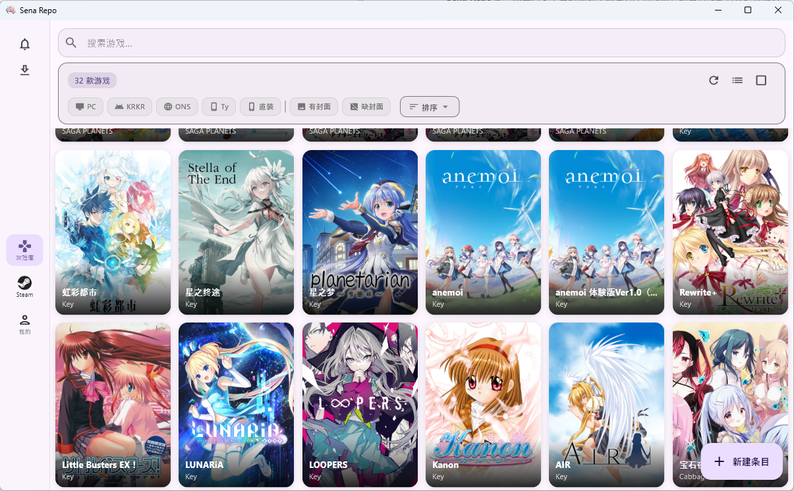
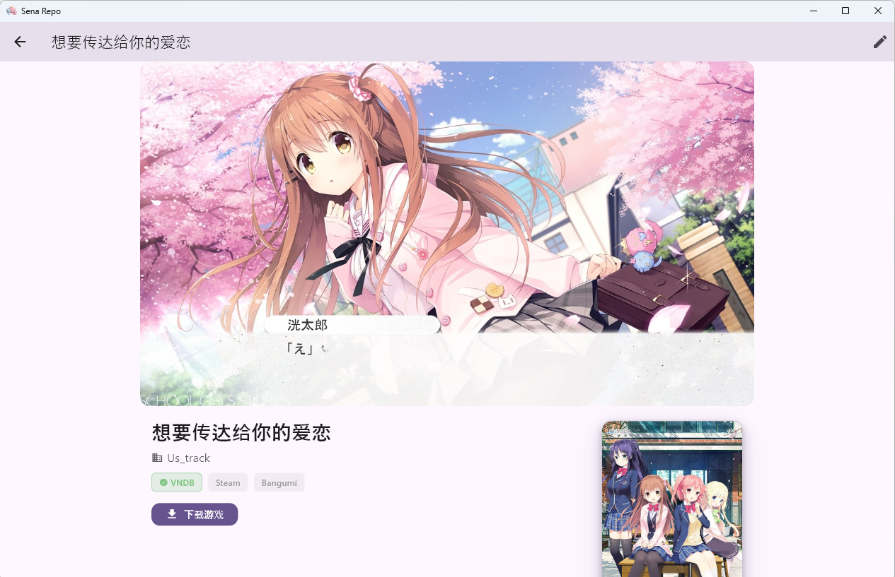
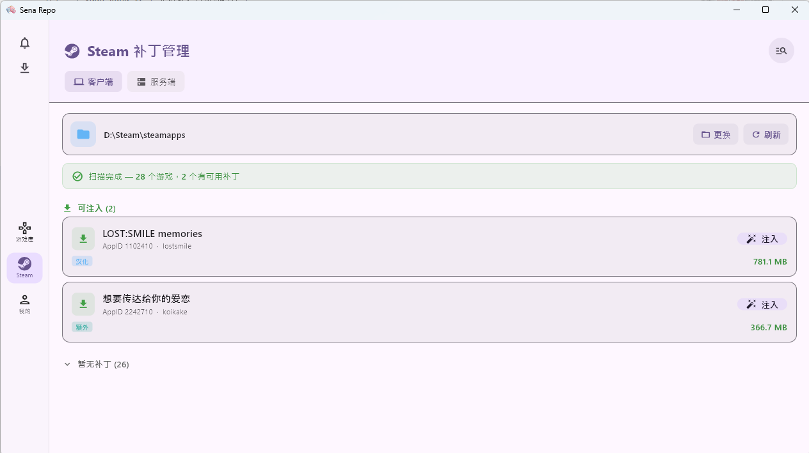
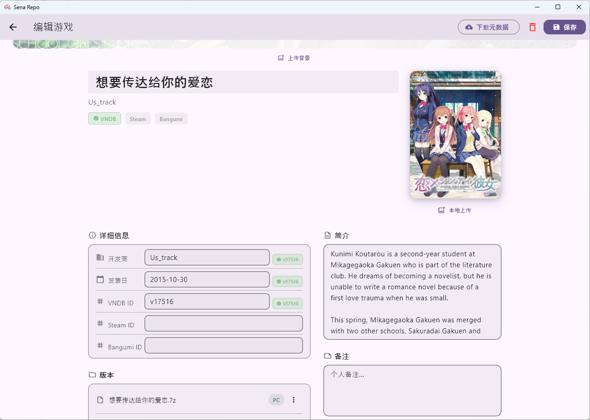
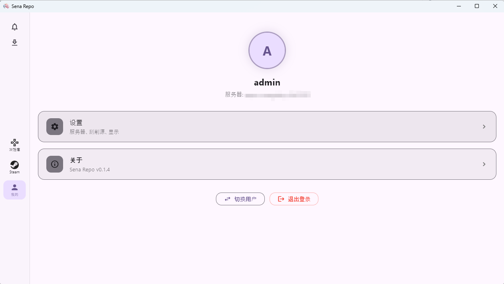

# Sena Repo

**Sena Repo** 是一款面向多平台的视觉小说私有库管理器，适合管理部署在远程服务器（如 NAS）上的游戏，让使用者能方便地浏览、搜索、下载与安装自己的游戏收藏。

服务端（Docker / Python）负责扫描目录、清洗文件名、刮削元数据 客户端（Windows / Android / Linux）通过 HTTP/HTTPS 连接服务端，提供一体化的游戏库浏览和下载安装体验。

---

## 主要功能

- 🌐 **多源刮削** — VNDB Kana v2 / Bangumi / Steam / DLsite / 月幕 GalGame，自动匹配已有游戏
- 📂 **目录扫描** — 识别会社/游戏/压缩包三级目录，自动清洗文件名并归类平台与版本
- 🖼️ **游戏库浏览** — 网格/列表双视图，按会社、标签、平台筛选，支持搜索与排序
- 🎮 **Steam 补丁注入** — 管理补丁压缩包，关键词快捷匹配类型并可批量注入

---

## 截图

<table align="center">
  <tr valign="top">
    <td align="center" width="50%">
      <b>游戏库</b> 
      <i>网格 / 列表双视图，按会社、标签、平台筛选</i> 
      
    </td>
    <td align="center" width="50%">
      <b>游戏详情页</b> 
      <i>封面、背景、简介、标签、版本列表与下载</i> 
      
    </td>
  </tr>
  <tr valign="top">
    <td align="center" width="50%">
      <b>Steam 补丁管理</b> 
      <i>客户端 / 服务端双 Tab，自动匹配与注入</i> 
      
    </td>
    <td align="center" width="50%">
      <b>元数据编辑</b> 
      <i>多源刮削结果逐字段对比勾选</i> 
      
    </td>
  </tr>
  <tr valign="top">
    <td align="center" width="50%">
      <b>我的</b> 
      <i>个人信息、用户管理与设置</i> 
      
    </td>
    <td align="center" width="50%">
    </td>
  </tr>
</table>

---

## 快速开始

> 📖 部署、安装等完整说明请参阅 **[部署说明书](Documentation/zh-CN/user-guide.md)**。

---

## 贡献

欢迎任何形式的贡献！请查看 [CONTRIBUTING.md](./CONTRIBUTING.md) 了解如何开始。

---

## 特别鸣谢

本项目在开发过程中参考与学习了以下优秀开源项目（排名不分先后）：

- [xm486/YukiHub](https://github.com/xm486/YukiHub)
- [INK666/myGal](https://github.com/INK666/myGal)
- [JosefNemec/Playnite](https://github.com/JosefNemec/Playnite)
- [huoshen80/ReinaManager](https://github.com/huoshen80/ReinaManager)
- [Saramanda9988/LunaBox](https://github.com/Saramanda9988/LunaBox)
- [bggRGjQaUbCoE/PiliPlus](https://github.com/bggRGjQaUbCoE/PiliPlus)
- [moraroy/NonSteamLaunchers-On-Steam-Deck](https://github.com/moraroy/NonSteamLaunchers-On-Steam-Deck)

感谢以上项目作者的付出。

---

## 免责声明

- 本项目为开源项目，仅用于合法用途，管理您有权使用的游戏/应用，如有侵权请告知。
- 您需要自行确认资源与第三方组件的合法性。
- 本项目不提供游戏本体、破解资源、绕过授权的能力或任何违规用途的支持。
- 本项目由 AI 辅助开发，安全性未经审计，服务端部署至公网前请自行加固。
- 本项目在后续更新中可能涉及服务端变动，可能存在无法保证数据更新的可能。

---

## 开源协议

本项目采用 **GNU Affero General Public License v3.0 (AGPL-3.0)**。

**你可以：**
- 自由使用、复制、修改、分发本项目
- 将本项目用于商业或非商业用途
- 将修改后的版本作为网络服务运行

**你需要：**
- 分发或公开部署修改后的版本时，开源你的修改
- 即使只通过网络提供服务（不分发二进制），也要提供源代码
- 保留原始版权声明和许可声明
- 使用相同的 AGPL-3.0 许可证

**简单来说：** 自己用随便改；如果把修改版给别人用或部署成公共服务，代码也要开源。
