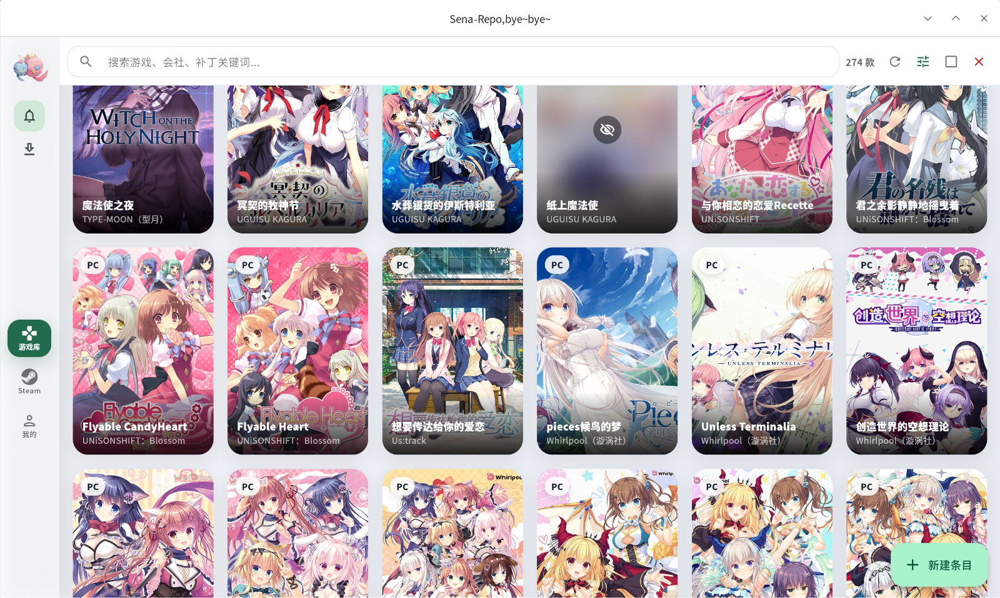
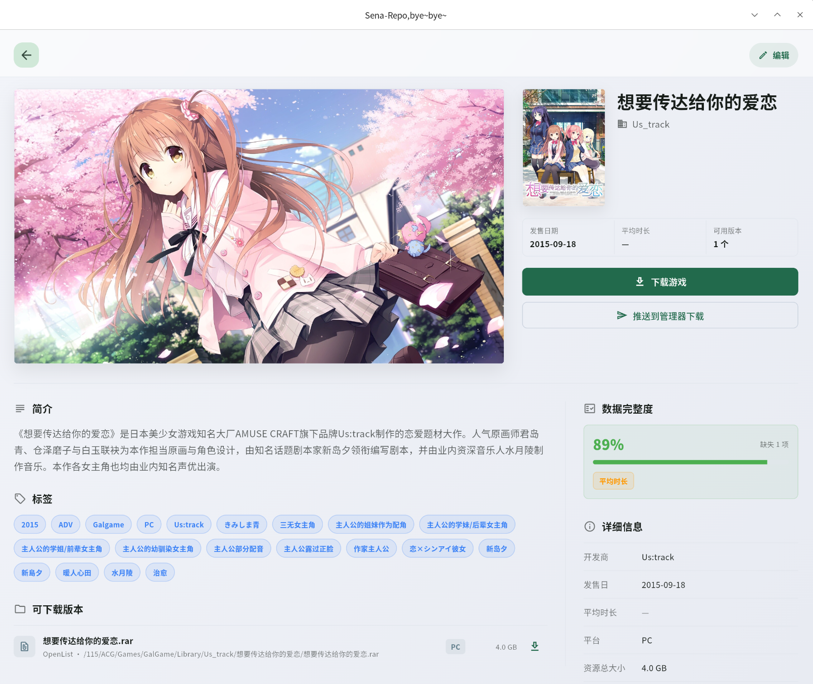
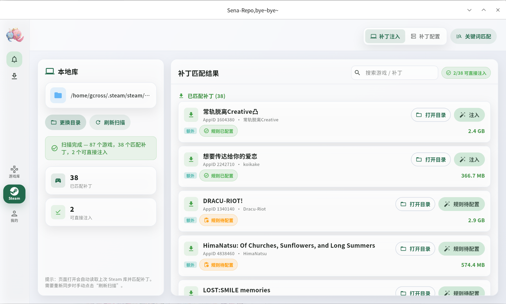
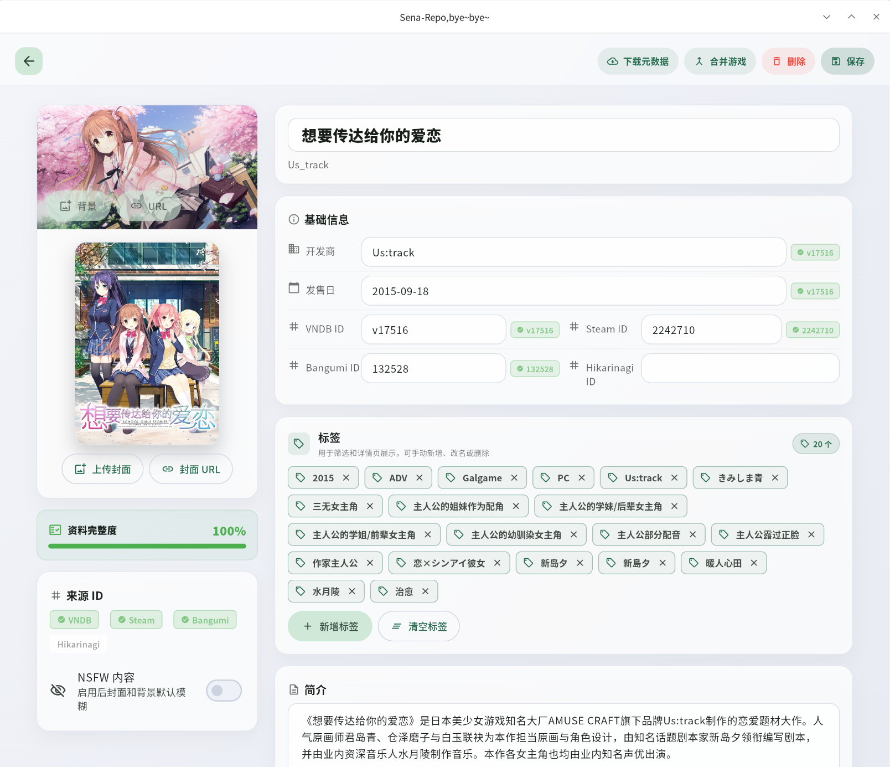
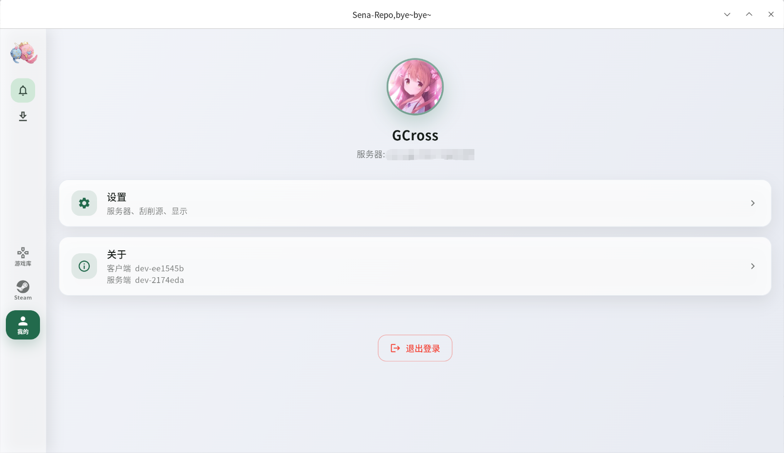

# Sena Repo

[English](README.md) | [简体中文](README_zh-CN.md)

The **Sena** in the project name comes from the heroine [Himeno Sena](https://www.kungal.com/galgame/character/38022) in the game [Koi x Shin Ai Kanojo](https://www.kungal.com/galgame/31).

---
## Introduction
**Sena Repo** is a multi-platform private library manager for visual novels, designed for managing games hosted on remote servers (such as a NAS), so you can browse, search, download, and install your game collection with ease.

Sena-Repo is not a local game manager; it is more like a site that you fully control.

## Key Features

- 🖼️ **A More Intuitive and Beautiful Library** — Scans, scrapes, and categorizes your visual novel files, then displays them in an organized layout in the client.
- 🌐 **Convenient Download and Install** — The client automatically downloads and extracts games to a specified directory, and can import them into Steam as non-Steam titles with generated desktop shortcuts.
- 🎮 **Steam Patch Injection** — Scans and scrapes matching patch files, then injects patches into visual novel games you own on Steam.

---

## Screenshots

<table align="center">
  <tr valign="top">
    <td align="center" width="50%">
      <b>Library</b> 
      <i>Grid / list dual views, filterable by brand, tag, and platform</i> 
      
    </td>
    <td align="center" width="50%">
      <b>Game Details</b> 
      <i>Cover, background, description, tags, version list, and downloads</i> 
      
    </td>
  </tr>
  <tr valign="top">
    <td align="center" width="50%">
      <b>Steam Patch Management</b> 
      <i>Client / server tabs, automatic matching and injection</i> 
      
    </td>
    <td align="center" width="50%">
      <b>Metadata Editing</b> 
      <i>Field-by-field comparison and selection of multi-source scrape results</i> 
      
    </td>
  </tr>
  <tr valign="top">
    <td align="center" width="50%">
      <b>Profile</b> 
      <i>Personal information, user management, and settings</i> 
      
    </td>
    <td align="center" width="50%">
    </td>
  </tr>

  
</table>

---

## Quick Start

For installation and usage guides, see the documentation: **[https://sena-repo.github.io](https://sena-repo.github.io/)**

---

## Contributing

Contributions of any kind are welcome! See [CONTRIBUTING.md](./CONTRIBUTING.md) to get started.

---

## Special Thanks

During development, this project referenced and learned from the following excellent open-source projects (in no particular order):
- [mcmilk/7-Zip-zstd](https://github.com/mcmilk/7-Zip-zstd)
- [OpenListTeam/OpenList](https://github.com/OpenListTeam/OpenList)
- [KunMoe/kun-galgame-forum](https://github.com/KunMoe/kun-galgame-forum)
- [Ringyuki/shionlib](https://github.com/Ringyuki/shionlib)
- [xm486/YukiHub](https://github.com/xm486/YukiHub)
- [INK666/myGal](https://github.com/INK666/myGal)
- [JosefNemec/Playnite](https://github.com/JosefNemec/Playnite)
- [huoshen80/ReinaManager](https://github.com/huoshen80/ReinaManager)
- [Saramanda9988/LunaBox](https://github.com/Saramanda9988/LunaBox)
- [bggRGjQaUbCoE/PiliPlus](https://github.com/bggRGjQaUbCoE/PiliPlus)
- [moraroy/NonSteamLaunchers-On-Steam-Deck](https://github.com/moraroy/NonSteamLaunchers-On-Steam-Deck)

Thanks to the authors and contributors of the projects above.

---

## Data Sources

- Galgame metadata is provided by the **NextMoe open API** (`https://api.nextmoe.dev/v2`). Per its attribution requirement, the API is credited as **"Kun Galgame Forum"** for Galgame data.

---

## Disclaimer

- This is an open-source project intended for lawful use only, for managing games/applications you have the right to use. If anything infringes your rights, please let us know.
- You are responsible for confirming the legality of the resources and third-party components you use.
- This project does not provide game files, cracked resources, authorization-bypass capabilities, or support for any unlawful use.
- This project is developed with AI assistance and has not been security-audited. Harden it yourself before deploying the server to the public internet.
- Future updates may involve server-side changes, and there is a possibility that data may not be preserved across updates.

## License

This project is licensed under the **GNU Affero General Public License v3.0 (AGPL-3.0)**.

**You are free to:**
- Use, copy, modify, and distribute this project
- Use this project for commercial or non-commercial purposes
- Run modified versions as a network service

**You must:**
- Open-source your modifications when you distribute or publicly deploy a modified version
- Provide the source code even if you only offer the service over a network (without distributing binaries)
- Retain the original copyright and license notices
- Use the same AGPL-3.0 license

**In short:** modify it freely for your own use; if you share a modified version or deploy it as a public service, you must open-source the code as well.
